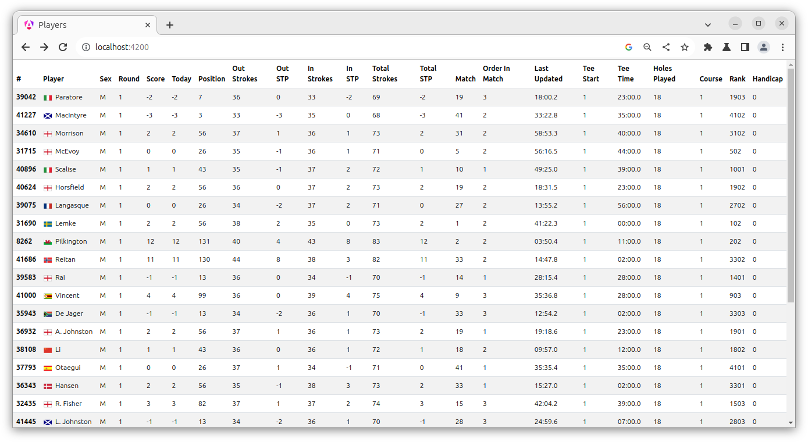

# Golf Tournament Real-Time Data Display

## Overview
This application serves as a user interface for a golf tournament, providing a dynamic and real-time display of player data. Developed with [Angular](https://angular.io/) and [Socket.IO](https://socket.io/), it connects to a server that broadcasts random player data at regular intervals.

## Setup and Installation

### Prerequisites
- Ensure you have [Node.js](https://nodejs.org/) installed.
- Angular CLI: Install it globally using `npm install -g @angular/cli`.

### Clone the Repository
- Use `git clone https://github.com/fabtjar/mst-golf.git` to clone the project repository.

### Install Dependencies
- Navigate to the project directory and run `npm install`.

## Running the Application
- Execute `ng serve` to start the development server.
- Open http://localhost:4200/ in your browser to view the application.